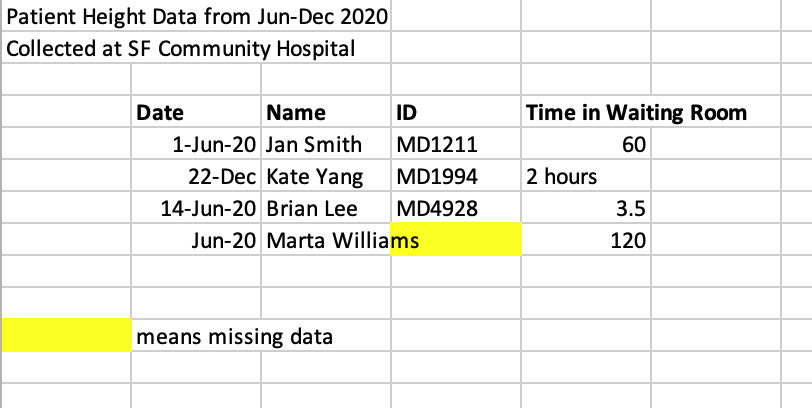
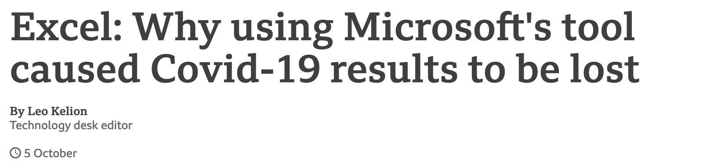
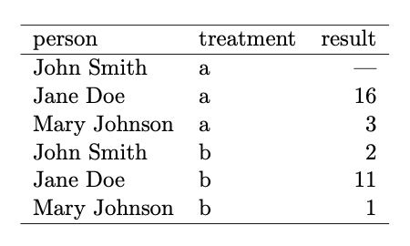
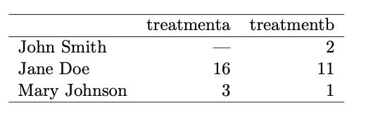
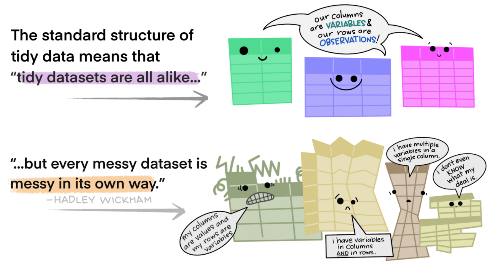
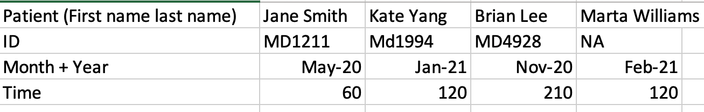
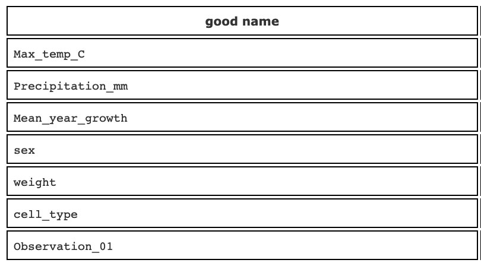
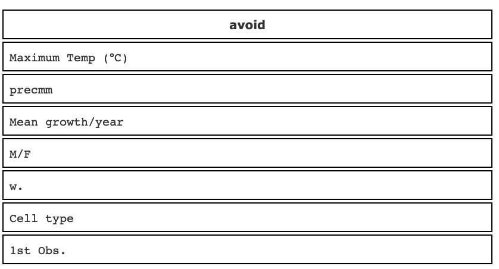
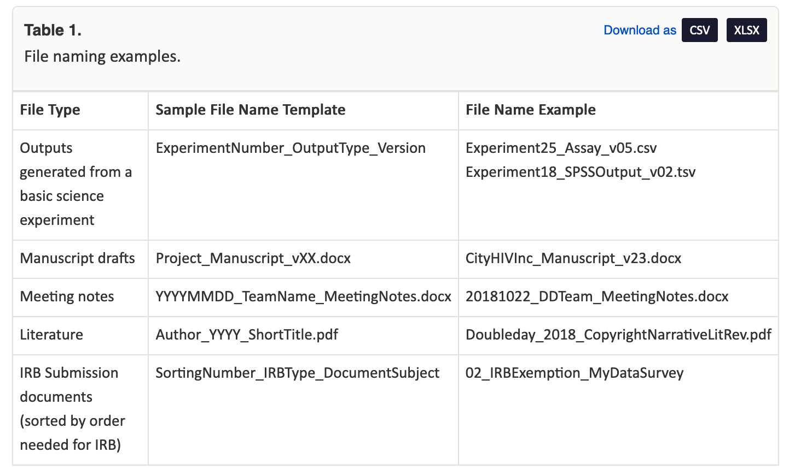
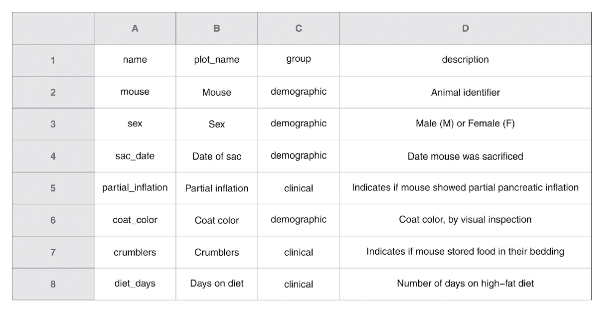

```{r xaringan-themer, include=FALSE, warning=FALSE}
library(xaringanthemer)
style_mono_accent(
  base_color = "#058488",
  header_font_google = google_font("Josefin Sans"),
  text_font_google   = google_font("Montserrat", "300", "300i"),
  code_font_google   = google_font("Fira Mono")
)
```

class: center, middle

# Welcome

Please sign in on the etherpad (link in the chat)

???
To toggle presenter mode, first press c to clone the window, then press p to enter presenter mode (share the screen on the other window) f for fullscreen

---

# Learning Objectives 

By the end of this workshop you should be able to:

* Describe best practices for reproducible data organization in spreadsheets
* Design tidy spreadsheets that can be used in a wide variety of data analysis software

---

Our goal today is to talk about how we can turn this:

<br>
--

```{r out.width = "75%", echo = FALSE}

```

--

Into this:

--


---

# Why should I care about spreadsheets?

Spreadsheets are everywhere! 

--

Terrible spreadsheets are everywhere too! 

???
- I bet that most of us have used a spreadsheet sometime this week, if not sometime already this morning. 
- Spreadsheets are used for everything from finance, to program admin work to research to data science.
- How many times have you opened up a spreadsheet and thought, what the heck does this mean?

---

## Messy spreadsheets can have real consequences

--

<br>



<br>

???
- Back in October the news came out that the British Government had been undercounting their COVID-19 cases because they were storing all the data in a spreadsheet with each case as a new column - they hit the limit of columns in excel and didn't realize.
- More likely consequence is that if your organization system is too bespoke you wont be able to load your data into other tools (like Tableau, Python, R) and other people won't be able to understand your data.

---

class: left, middle

## Thankfully there are some simple steps we can take to make our spreadsheets understandable & reproducible!

???
Nothing we are talking about today is rocket science, it is about implementing good practices and sticking with them.

---

# Spreadsheets as part of a reproducible (research) pipeline

* Use spreadsheets for data entry and data storage
* Once data has been collected it is time to move on to another tool for data analysis and visualization (like R, Python, SAS, STATA, or Tableau)
* Data analysis in spreadsheets is messy, fraught with errors, and not easily reproduced

???
- If we are being precise here, spreadsheets are not a great tools for data analysis. Ideally we collect data in spreadsheets, and then analyze in another tool. 
- But we understand that sometimes you just need to pull some quick numbers, in which case excel can work.

---

# How should my spreadsheets be structured?

--

Follow the principles of **Tidy Data!**

.pull-left[

In Tidy Data:
- Each variable forms a column
- Each observation forms a row
- Each cell is a single measurement]

.pull-right[]

Source: [Wickham, 2014](https://www.jstatsoft.org/article/view/v059i10)


???
- Tidy data was a term coined by statistician Hadley Wickham but you may also know this as database format or skinny data

---
class: left

Tidy Data


--

Not Tidy Data

.pull-left[


Source: [Wickham, 2014](https://www.jstatsoft.org/article/view/v059i10)]

.pull-right[



]

---

## Tidy vs Messy Data


Source: [Lowndes & Horst, 2020](https://docs.google.com/presentation/d/1N7hKepabvl9OrHjvGJWPjUsfzVdB5xzV5AsFndgSwms/edit#slide=id.p)

---

# Activity 1 - Tidy that Data!

How should we re-arrange this data to make it Tidy? 

Share your ideas for new column headers in the etherpad!




---

class: left, middle

## Once we have our structure down, it is time to look at your values and variables

---

## What names should I use?

--

Make those variable (column) names descriptive!

* Avoid spaces - use underscores, dashes or CamelCase
* Avoid special characters (?|&"")
* Be short but descriptive (what does "w." mean?)
* Include units for clarity
* Be consistent!

.pull-left[

]

.pull-right[

]

source: [Broman & Woo, 2017](https://www.tandfonline.com/doi/full/10.1080/00031305.2017.1375989)
---

File names matter too!

* Use meaningful file names that will sort
* What crucial info will help you know exactly which file is which?

```{r, eval= TRUE, echo=FALSE}

```
source: [Briney, Coates, & Goben, 2020](https://riojournal.com/article/56508/instance/5569704/)

---

## Dates

Did you know there is an international standard for dates (ISO 8601)?

--

### .center[YYYY-MM-DD]

--

Note that Excel can get real funky with dates! You can get around this by:
* Changing your dates to text values rather than dates
* Separating your dates into columns for year, month, and day


???
This is especially great for file names because it sorts!
---

## Null/Missing Values

Be precise about whether data is missing or has a value of zero

If data has a value of zero, write in a 0

If data is missing, indicate with NA/NULL

???
- Note that the exact term you use can differ depending on what software you are planning on using (NA for R programming, NaN in python)
- Either way you want to choose one method and stick to it, you can always change it later if you were consistent

---

## Avoid formatting in Excel

Excel can make things beautiful but don't use formatting to add crucial information to your spreadsheet.

Don't use formatting to encode meaning (highlighted/bolded cells to indicate something). Add this information in a new cell/column

---

## Create a data dictionary!



source: [Broman & Woo, 2017](https://www.tandfonline.com/doi/full/10.1080/00031305.2017.1375989)

???
Even if you set up the most beautiful understandable spreadsheet it is always useful to create a data dictionary where you can be specific about your variables and what they mean

---

# Activity 2: Critique a messy data spreadsheet

You will have 10 minutes in breakout rooms to critique [a messy spreadsheet of COVID data](https://github.com/arieldeardorff/SpreadsheetWorkshop/raw/master/COVIDData_Messy.xlsx) 
* What spreadsheet issues do you see?
* How would you design it differently?

Note that this is real COVID data from Carbon Health that has been messed up for our class.

Share your ideas in the etherpad and we will discuss as a group.

???
Ideas:
- Standardize data, separate into year, month, date
- Separate out swab test name and type (nasal, Nasopharyngeal)
- collapse test results into one column (negative or positive)
- Separate out co-morbidities and risks (change to yes/no)
- Separate out vitals
- get rid of red for missing data - change to NA
- get rid of spaces in names
- make variable names more specific (rr, sats, ctab)

---

# What else can I do to keep my spreadsheets reproducible?

--

* Consider using data validation features in Excel during data entry
* Create a backup copy!

---

# How do I fix existing messy spreadsheets?

--

Here are some tools and tutorials you can use if you need to clean up already messy spreadsheets:

* OpenRefine - [tool](https://openrefine.org/), [tutorial](https://arieldeardorff.github.io/OpenRefineWorkshop/index.html) (open source data cleaning software)
* R Tidyverse - [tool](https://www.tidyverse.org/), [tutorial](https://rstudio-conf-2020.github.io/r-for-excel/) (R package for cleaning spreadsheet data)
* Python Pandas - [tool](https://pandas.pydata.org/), [tutorial](https://courses.ucsf.edu/course/view.php?id=5248) 

---

# Learn More

Check out these articles to learn more about tidy data or organizing data in spreadsheets:

Briney KA, Coates H, Goben A (2020) Foundational Practices of Research Data Management. Research Ideas and Outcomes 6: e56508. [https://doi.org/10.3897/rio.6.e56508](https://doi.org/10.3897/rio.6.e56508)

Broman, K. & Woo, K (2018) Data Organization in Spreadsheets, The American Statistician, 72:1, 2-10, DOI: [10.1080/00031305.2017.1375989](https://www.tandfonline.com/doi/full/10.1080/00031305.2017.1375989) 

Wickham, H. (2014). Tidy Data. Journal of Statistical Software, 59(10), 1 - 23. doi:[http://dx.doi.org/10.18637/jss.v059.i10](http://dx.doi.org/10.18637/jss.v059.i10)

---

class: left, middle

# What Questions Do You Have?

---

# References

Briney KA, Coates H, Goben A (2020) Foundational Practices of Research Data Management. Research Ideas and Outcomes 6: e56508. [https://doi.org/10.3897/rio.6.e56508](https://doi.org/10.3897/rio.6.e56508)

Broman, K. & Woo, K (2018) Data Organization in Spreadsheets, The American Statistician, 72:1, 2-10, DOI: [10.1080/00031305.2017.1375989](https://www.tandfonline.com/doi/full/10.1080/00031305.2017.1375989) 

Carbon Health and Braid Data. (2020) Coronavirus Disease 2019 (COVID-19) Clinical Data Repository. Accessed from [https://covidclinicaldata.org/](https://covidclinicaldata.org/) 

Lowndes, J. & Horst, A. (2020) Tidy Data for Efficiency, Reproducibility, and Collaboration. OpenScapes [https://www.openscapes.org/blog/2020/10/12/tidy-data/](https://www.openscapes.org/blog/2020/10/12/tidy-data/)

Sherry Lake, Tim Dennis, Jez Cope, Francois Michonneau, Christopher Erdmann, erikamias, … yvonnemery. (2020, July). LibraryCarpentry/lc-spreadsheets: LibraryCarpentry/lc-spreadsheets: Library Carpentry: Tidy data for Librarians, July 2020 (Version v2020.07.1). Zenodo. [http://doi.org/10.5281/zenodo.3954067](http://doi.org/10.5281/zenodo.3954067)

Wickham, H. (2014). Tidy Data. Journal of Statistical Software, 59(10), 1 - 23. doi:[http://dx.doi.org/10.18637/jss.v059.i10](http://dx.doi.org/10.18637/jss.v059.i10)  

