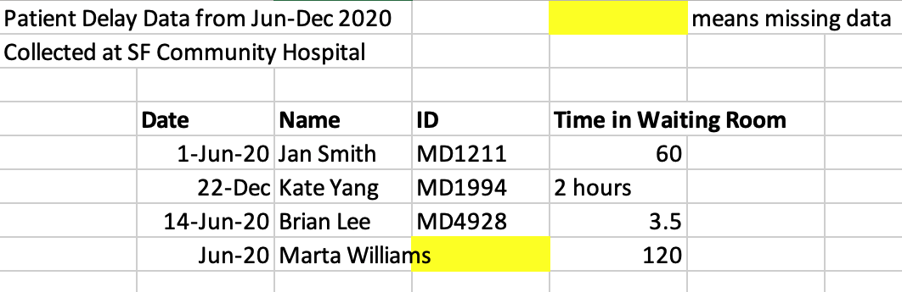
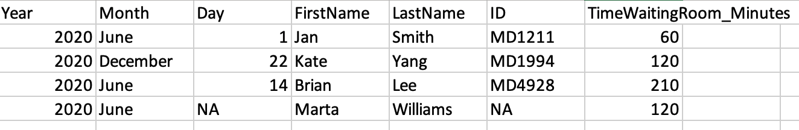
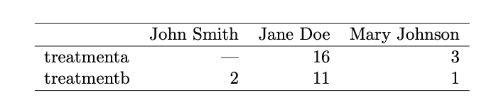

```{r xaringan-themer, include=FALSE, warning=FALSE}
library(xaringanthemer)
style_mono_accent(
  base_color = "#058488",
  header_font_google = google_font("Josefin Sans"),
  text_font_google   = google_font("Montserrat", "300", "300i"),
  code_font_google   = google_font("Fira Mono")
)
```

class: center, middle

# Welcome

---

# Learning Objectives 

By the end of this workshop you should be able to:

* Describe best practices for reproducible data organization in spreadsheets
* Design tidy spreadsheets that can be used in a wide variety of data analysis software

---

Our goal today is to talk about how we can turn this:

<br>
--

```{r out.width = "75%", echo = FALSE}

```

--

Into this:

--



---

class: left, middle

## But first, let's hear from you!

---

# Why should I care about spreadsheets?

Spreadsheets are everywhere! 

--

Terrible spreadsheets are everywhere too! 

---

## Messy spreadsheets can have real consequences

--

<br>


<br>

???
Case study of the British Government 
- Also can't properly load your data into software tools if it isnt formatted properly (Tableau, OpenRefine, SPSS, Python)

---

class: left, middle

## Thankfully there are some simple steps we can take to make our spreadsheets understandable & reproducible!

---

# Spreadsheets as part of a reproducible pipeline

* Use spreadsheets for data entry and data storage
* Once data has been collected it is time to move on to another tool for data analysis and visualization (like R, Python, SAS, STATA, or Tableau)
* Data analysis in spreadsheets is messy, fraught with errors, and not easily reproduced

---

# How should my spreadsheets be structured?

--

Follow the principles of **Tidy Data!**

.pull-left[

In Tidy Data:
- Each variable forms a column
- Each observation forms a row
- Each cell is a single measurement]

.pull-right[]

Source: [Wickham, 2014](https://www.jstatsoft.org/article/view/v059i10)

---
class: left

Tidy Data


--

Not Tidy Data

.pull-left[




Source: [Wickham, 2014](https://www.jstatsoft.org/article/view/v059i10)]

.pull-right[


]

---

## Tidy vs Messy Data


Source: [Lowndes & Horst, 2020](https://docs.google.com/presentation/d/1N7hKepabvl9OrHjvGJWPjUsfzVdB5xzV5AsFndgSwms/edit#slide=id.p)

---

# Activity 1 - Tidy that Data!

How should we re-arrange this data to make it Tidy? 

Share your ideas in the etherpad!


---

class: left, middle

## Once we have our structure down, it is time to look at your values and variables

---

## What names should I use?

Make those variable (and file) names descriptive!

.pull-left[

]

.pull-right[

]

source: [Broman & Woo, 2017](https://www.tandfonline.com/doi/full/10.1080/00031305.2017.1375989)
---

File names matter too!

```{r, eval= TRUE, echo=FALSE}
knitr::include_graphics("Images/FileNaming.png")
```
source: [Briney, Coates, & Goben, 2020](https://riojournal.com/article/56508/instance/5569704/)

---

## Dates

Did you know there is an international standard for dates (ISO 8601)?

### .center[YYYY-MM-DD]

Note that Excel can get real funky with dates!

You can get around this by:
* Changing your dates to text values rather than dates
* Separating your dates into columns for year, month, and day

---

## Null/Missing Values

Be precise about whether data is missing or has a value of zero

If data has a value of zero, write in a 0

If data is missing, indicate with NA/NULL

---

## Avoid formatting in Excel

Excel can make things beautiful but don't use formatting to add data to your spreadsheet.

Don't use formatting to encode meaning (highlighted/bolded cells to indicate something). Add this information in a new cell/column

---

## Create a data dictionary!


source: [Broman & Woo, 2017](https://www.tandfonline.com/doi/full/10.1080/00031305.2017.1375989)

---

# Activity 2: Critique a messy data spreadsheet

You will have 10 minutes in breakout rooms to critique a messy spreadsheet of COVID data. 
* What spreadsheet errors do you see?
* How would you design it differently?

Note that this is real COVID data from Carbon Health that has been messed up for our class.

Share your ideas in the etherpad and we will discuss as a group.

---

# What else can I do to keep my spreadsheets reproducible?

* Consider using data validation features in Excel during data entry
* Save as a plain text file (CSV)
* Create a backup copy!

---

# How do I fix existing messy spreadsheets?
Here are some tools and tutorials you can use if you need to clean up already messy spreadsheets:

* OpenRefine - [tool](https://openrefine.org/), [tutorial](https://arieldeardorff.github.io/OpenRefineWorkshop/index.html) (open source data cleaning software)
* R Tidyverse - [tool](https://www.tidyverse.org/), [tutorial](https://rstudio-conf-2020.github.io/r-for-excel/) (R package for cleaning spreadsheet data)
* Python Pandas - [tool](https://pandas.pydata.org/), [tutorial](https://courses.ucsf.edu/course/view.php?id=5248) 

---

# Learn More

Check out these articles to learn more about tidy data or organizing data in spreadsheets:

Briney KA, Coates H, Goben A (2020) Foundational Practices of Research Data Management. Research Ideas and Outcomes 6: e56508. [https://doi.org/10.3897/rio.6.e56508](https://doi.org/10.3897/rio.6.e56508)

Broman, K. & Woo, K (2018) Data Organization in Spreadsheets, The American Statistician, 72:1, 2-10, DOI: [10.1080/00031305.2017.1375989](https://www.tandfonline.com/doi/full/10.1080/00031305.2017.1375989) 

Wickham, H. (2014). Tidy Data. Journal of Statistical Software, 59(10), 1 - 23. doi:[http://dx.doi.org/10.18637/jss.v059.i10](http://dx.doi.org/10.18637/jss.v059.i10)

---

class: left, middle

# What Questions Do You Have?

---

# References

Briney KA, Coates H, Goben A (2020) Foundational Practices of Research Data Management. Research Ideas and Outcomes 6: e56508. [https://doi.org/10.3897/rio.6.e56508](https://doi.org/10.3897/rio.6.e56508)

Broman, K. & Woo, K (2018) Data Organization in Spreadsheets, The American Statistician, 72:1, 2-10, DOI: [10.1080/00031305.2017.1375989](https://www.tandfonline.com/doi/full/10.1080/00031305.2017.1375989) 

Carbon Health and Braid Data. (2020) Coronavirus Disease 2019 (COVID-19) Clinical Data Repository. Accessed from [https://covidclinicaldata.org/](https://covidclinicaldata.org/) 

Lowndes, J. & Horst, A. (2020) Tidy Data for Efficiency, Reproducibility, and Collaboration. OpenScapes [https://www.openscapes.org/blog/2020/10/12/tidy-data/](https://www.openscapes.org/blog/2020/10/12/tidy-data/)

Sherry Lake, Tim Dennis, Jez Cope, Francois Michonneau, Christopher Erdmann, erikamias, … yvonnemery. (2020, July). LibraryCarpentry/lc-spreadsheets: LibraryCarpentry/lc-spreadsheets: Library Carpentry: Tidy data for Librarians, July 2020 (Version v2020.07.1). Zenodo. [http://doi.org/10.5281/zenodo.3954067](http://doi.org/10.5281/zenodo.3954067)

Wickham, H. (2014). Tidy Data. Journal of Statistical Software, 59(10), 1 - 23. doi:[http://dx.doi.org/10.18637/jss.v059.i10](http://dx.doi.org/10.18637/jss.v059.i10)

